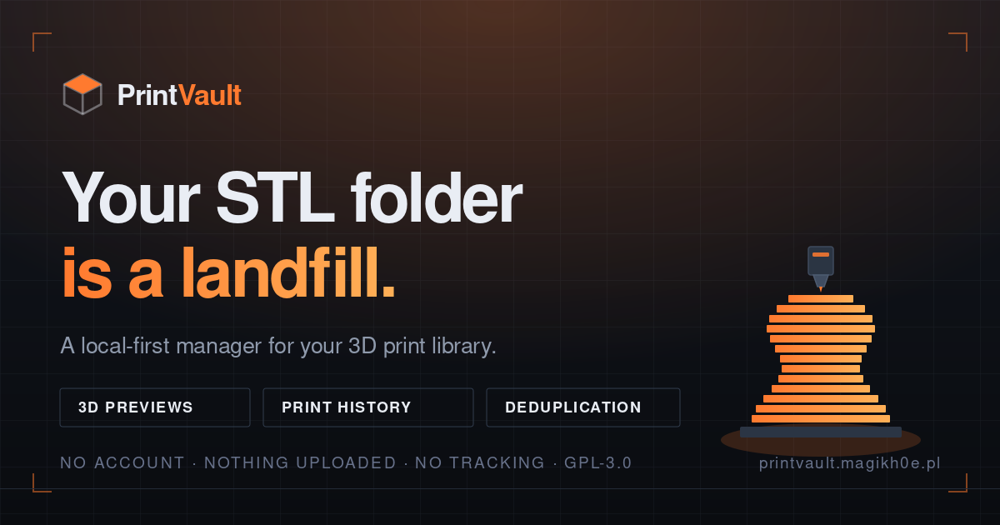

# PrintVault



I had about 460 files in a folder called "3d print files". Half a dozen
subfolders named "files". No idea which settings I'd used on anything I'd
already printed. When I finally got a proper index of it there were 78 zips
I'd never extracted, holding 414 printable models that nothing had ever shown
me.

This is what I built to dig myself out. It's free, GPL-3.0, and runs either in
your browser or as a desktop app.

Live at https://printvault.magikh0e.pl/

## Get it

Nothing to install if you just want to try it: open
[printvault.magikh0e.pl](https://printvault.magikh0e.pl/) in Chrome, Edge,
Brave or Opera and point it at a folder.

The desktop app is worth it if you have a lot of files, keep them on a network
share, or are tired of re-granting folder access every session. Grab an
installer from
[Releases](https://github.com/magikh0e/PrintVault/releases):

| Platform | File |
| --- | --- |
| Windows | `.msi` or `.exe` |
| macOS | `.dmg` (universal, Intel and Apple Silicon) |
| Linux | `.AppImage`, `.deb` or `.rpm` |

The builds aren't code signed, because certificates cost more than this
project does. Windows SmartScreen will want "More info" then "Run anyway", and
macOS will want a right-click then Open the first time. If that bothers you,
build it yourself from source below; it's the same thing.

Windows has been tested against a real library. macOS and Linux build cleanly
in CI but nobody has run them against a folder yet, so treat those as untested
and tell me if something breaks.

## What it does

Point it at a folder and it reads what's already there. Nothing gets moved,
renamed, or reorganised into somebody else's idea of a good structure.

It renders a 3D preview for every model, so you're looking at pictures instead
of filenames, and reuses the plate render your slicer already embedded when
there is one.

It pulls settings out of your sliced gcode: time, grams, layer height, nozzle,
infill, material, profile name. Works with PrusaSlicer, OrcaSlicer,
BambuStudio, Creality Print and Cura. Creality Print and Bambu bury the gcode
inside their `.3mf` project files, so it digs that back out. Log a print when
it comes off the bed and the form is already filled in, which means six months
later you can still see what you ran and whether it worked.

It reads inside zips you never extracted, listing and previewing what's in
them without unpacking anything. It'll extract them too, and checksums every
file it writes.

It finds duplicate downloads and proves they're identical with SHA-256 before
touching anything. By default it moves the copies to a quarantine folder
rather than deleting them, because a browser can't use the Recycle Bin and I
didn't want that on my conscience.

There's filament tracking by what's actually left on the spool, and a print
queue that adds up grams and hours so you know whether you can finish
something before you start it.

No account, nothing uploaded, no server involved.

## How it's put together

```
index.html            the whole app, one self-contained file
desktop/              Tauri shell
  build.mjs           copies index.html into dist/, syncs version numbers
  serve.mjs           dev-only static server with correct MIME types
  make-icon.mjs       generates every app icon from raw pixels
  src-tauri/          Rust backend
```

The same `index.html` runs in a browser and inside the desktop shell. It picks
its filesystem layer when it loads, either the File System Access API or
native calls through Tauri, and the other 96% of the code doesn't know or care
which. No build step, no bundler, no dependencies.

## Self-hosting the web version

Serve the folder over `https` or `http://localhost` and open
`index.html`. It won't work from a `file://` path, because browsers only hand
out folder access in a secure context. Chromium only for the folder part
(Chrome, Edge, Brave, Opera), since Firefox and Safari don't implement the API.

## Building the desktop app

You need [Rust](https://rustup.rs/) and Node 20+. On Linux you also need the
WebKitGTK development packages:

```bash
sudo apt install libwebkit2gtk-4.1-dev libgtk-3-dev \
  libayatana-appindicator3-dev librsvg2-dev libssl-dev
```

Then:

```bash
cd desktop
npm install
npm run tauri:dev      # with frontend hot reload
npm run tauri:build    # installers land in src-tauri/target/release/bundle/
```

There's no frontend build step. `build.mjs` copies `index.html` into `dist/`
and stamps its version into the shell, so the two can't drift. Icons are
generated by `make-icon.mjs` rather than committed, so if `tauri:build`
complains about a missing icon, run that first.

`tauri:dev` serves the frontend through `serve.mjs` rather than Tauri's own dev
server, which hands `index.html` back as `application/octet-stream` and leaves
WebView2 showing a blank window.

## Why bother with the desktop build

Almost everything annoying about the browser version is the browser, not the
app.

Browsers forget folder access between sessions, so every visit starts by
clicking Scan to re-grant it. Roots are stored as paths here, and paths
survive a restart.

Speed is the bigger one. A browser has to open every file individually just to
learn how big it is. One Rust call returns the whole listing with sizes and
timestamps, which on a network share is the difference between minutes and
seconds.

Archives are unpacked in Rust too, so entry bytes never cross into JavaScript.
That fixes large entries running the browser out of memory, and gets you bzip2
and zstd, which browsers can't inflate at all.

And Firefox and Safari don't implement the File System Access API, so the web
version can't work there no matter what. The desktop build doesn't care.

## Licence

GPL-3.0-or-later, see [LICENSE](LICENSE).
